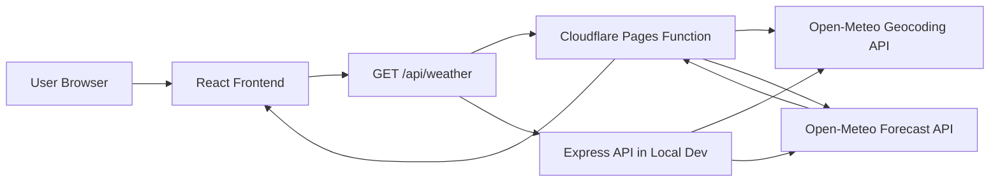
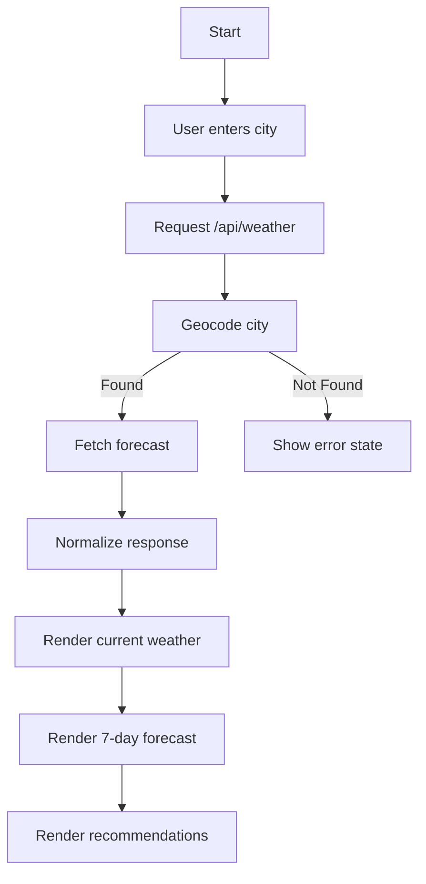
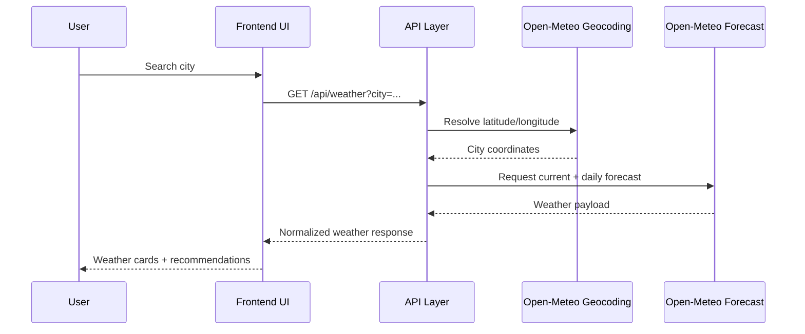
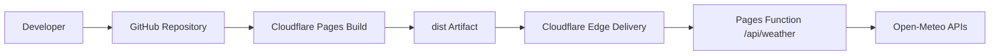

# Weather Intelligence Platform


A production-style weather intelligence application built with React, Vite, and Open-Meteo APIs. The app lets users search cities, view current weather, inspect 7-day forecast trends, and receive practical planning recommendations.

## Table of Contents

- Overview
- Architecture
- Application Flow
- Features
- Tech Stack
- Project Structure
- API Design
- Recommendation Rules
- Setup and Run
- Cloudflare Deployment
- Security Notes
- Scalability and Performance
- QA and Validation
- Submission Evidence Checklist
- Optimization Report
- Contribution Guide
- License

## Overview

### Problem Statement
Users need quick and clear weather insights for daily planning, but many weather tools are cluttered, key-gated, or not assignment friendly.

### Solution
This project provides:
- Fast city-based search
- Current conditions view
- 7-day forecast cards
- Rule-driven recommendations
- Friendly invalid city and network error states

### Target Users
- Learners completing app deployment assignments
- Users planning daily activities using weather conditions
- Recruiters evaluating frontend + API + deployment skills

## Architecture

### High-Level Architecture Diagram



### Architecture Style
- Client-server, layered architecture
- SPA frontend with serverless API adapter for deployment
- Stateless weather requests

### Runtime Modes
- Local mode: Vite dev server + Express middleware route
- Cloud mode: Cloudflare Pages + Pages Functions

## Application Flow

### Functional Flowchart



### Sequence Diagram



## Features

### Core Features
- City search
- Current weather details:
  - Temperature
  - Weather condition
  - Wind speed
  - Humidity
  - Pressure
  - Sunrise and sunset
- 7-day forecast:
  - Day label
  - Max/min temperatures
  - Weather condition
  - Rain probability
- Recommendation cards
- Invalid city handling
- Network failure handling
- Responsive layout

### Assignment Validation Cases
- Valid city: Chennai
- Valid city: Bangalore
- Invalid city: InvalidCity987654

## Tech Stack

| Layer | Technology | Purpose |
|---|---|---|
| Frontend | React 18 | Component-based UI |
| Build Tool | Vite 8 | Fast development and production builds |
| Styling | Tailwind CSS 3 | Utility-first responsive UI |
| Icons | Lucide React | Weather and UX iconography |
| Local API | Express 5 | Local development API integration |
| Cloud API Runtime | Cloudflare Pages Functions | Serverless API endpoint in deployment |
| External Data | Open-Meteo APIs | Geocoding and forecast weather data |

## Project Structure

```text
weather-intelligence/
├─ client/
│  ├─ components/
│  │  └─ ui/
│  ├─ hooks/
│  ├─ lib/
│  ├─ pages/
│  │  ├─ Index.jsx
│  │  └─ NotFound.jsx
│  ├─ App.jsx
│  └─ global.css
├─ functions/
│  └─ api/
│     └─ weather.js
├─ server/
│  ├─ routes/
│  │  ├─ demo.js
│  │  └─ weather.js
│  ├─ index.js
│  └─ node-build.js
├─ netlify/
│  └─ functions/
│     └─ api.js
├─ public/
├─ package.json
├─ vite.config.js
├─ SUBMISSION_CHECKLIST.md
└─ VIVA_SCRIPT.md
```

## API Design

### Main Endpoint

```http
GET /api/weather?city=<city-name>
```

### Internal API Steps
1. Resolve city to coordinates via Open-Meteo Geocoding API.
2. Request current and 7-day data via Open-Meteo Forecast API.
3. Normalize payload into frontend-friendly format.
4. Return structured JSON.

### Example Success Response (Simplified)

```json
{
  "city": {
    "name": "Chennai",
    "country": "India",
    "latitude": 13.08,
    "longitude": 80.27,
    "timezone": "Asia/Kolkata"
  },
  "current": {
    "temperature": 29,
    "condition": "Partly cloudy",
    "windSpeed": 18,
    "humidity": 74
  },
  "daily": [
    {
      "day": "Today",
      "high": 33,
      "low": 26,
      "rainProbability": 66
    }
  ]
}
```

### Error Responses

```json
{ "message": "Query parameter 'city' is required." }
```

```json
{ "message": "City not found. Try a different city name." }
```

## Recommendation Rules

Recommendations are generated from weather values:
- High rain probability: carry umbrella
- High UV: sun safety
- Strong wind: caution for outdoor plans
- Additional comfort hints from humidity/feels-like patterns

## Setup and Run

### Prerequisites
- Node.js 20 or newer
- npm 10 or newer

### Installation

```bash
git clone https://github.com/prawinkumar2k/weather-intelligence.git
cd weather-intelligence
npm install
```

### Development Run

```bash
npm run dev
```

Local URL:
- http://localhost:8080

### Production Build

```bash
npm run build
```

Expected output:
- dist/

### Optional Local Production Server

```bash
npm run build:server
npm run start
```

## Cloudflare Deployment

Create a Cloudflare Pages project from GitHub and configure exactly:

| Setting | Value |
|---|---|
| Framework Preset | Vite |
| Build Command | npm run build |
| Build Output Directory | dist |
| Root Directory | / |
| Node Version | 20 |
| Environment Variables | None |

### Deployment Flow Diagram



## Security Notes

### Current Security Posture
- No private API keys required
- No Firebase, no Gemini API, no Google Cloud APIs
- Graceful user-facing error handling
- Local secret files excluded from Git tracking

### Not Implemented in Current Scope
- Authentication and authorization
- Rate limiting
- WAF policy tuning
- Persistent audit logging

## Scalability and Performance

### Current Strengths
- Static frontend delivery via edge CDN
- Stateless API requests
- Simple, deterministic response normalization

### Recommended Improvements
- Request debouncing on search input
- Short TTL edge caching for popular cities
- Abort in-flight stale requests when user searches rapidly
- Add automated lint/test CI gate before deploy

## QA and Validation

### Functional QA
- Search Chennai: verify current + forecast + recommendations
- Search Bangalore: verify current + forecast + recommendations
- Search InvalidCity987654: verify friendly error state

### UI QA
- Desktop view
- Mobile viewport view
- No obvious runtime errors in browser console

### Build QA

```bash
npm run build
```

Must complete successfully and generate dist output.

## Submission Evidence Checklist

Capture screenshots of:
1. GitHub repository home page
2. README displayed on GitHub
3. Cloudflare build configuration
4. Cloudflare successful deployment screen
5. Live pages.dev home page
6. Chennai search result
7. Bangalore search result
8. Invalid city result

Support docs in repository:
- SUBMISSION_CHECKLIST.md
- VIVA_SCRIPT.md

## Optimization Report

### Improvements Already Applied
- Geocoding ambiguity fix (Bangalore alias resolution)
- Quick-search click handler bug fix
- Cloudflare Pages function compatibility
- README documentation uplift

### Recommended Next Refactors
- Move weather business logic from page file into service and hook modules
- Reduce unused UI primitives for leaner repository footprint
- Add end-to-end smoke tests for deployment verification

## Contribution Guide

1. Fork repository
2. Create a feature branch
3. Make focused changes
4. Validate with npm run build
5. Open pull request with summary and screenshots if UI changes

## License

No license file is currently included.
Recommended: add MIT License for open-source clarity.
# weather-intelligance

